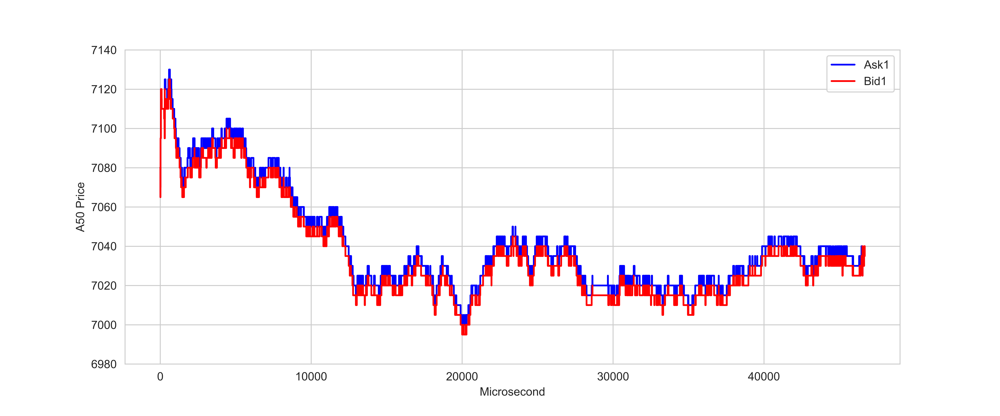

# HFT-ML-Strategy

Replicate well-designed high frequency trading (HFT) strategies built using machine learning and deep learning techniques. Extract trading signals from multi-level orderbook data.

- Orderbook data: SGX FTSE CHINA A50 INDEX Futures (新加坡交易所FTSE中国A50指数期货) tick depth data

- The training pipline:
  
  

* Feature Extractor

  * Rise Ratio
  
    

  * Depth Ratio
  
    
    
    [Note] : [Feature_Selection] (Feature_Selection) 
 
* Learning Model Trainer
  
  *  RandomForestClassifier
  *  ExtraTreesClassifier
  *  AdaBoostClassifier
  *  GradientBoostingClassifier
  *  SVM
  
*  Use best model to predict next 10 seconds

   
   
*  Prediction outcome

   
   
*  Profit & Loss

   
   
   [Note] : [Model_Selection] (Model_Selection) 

 

